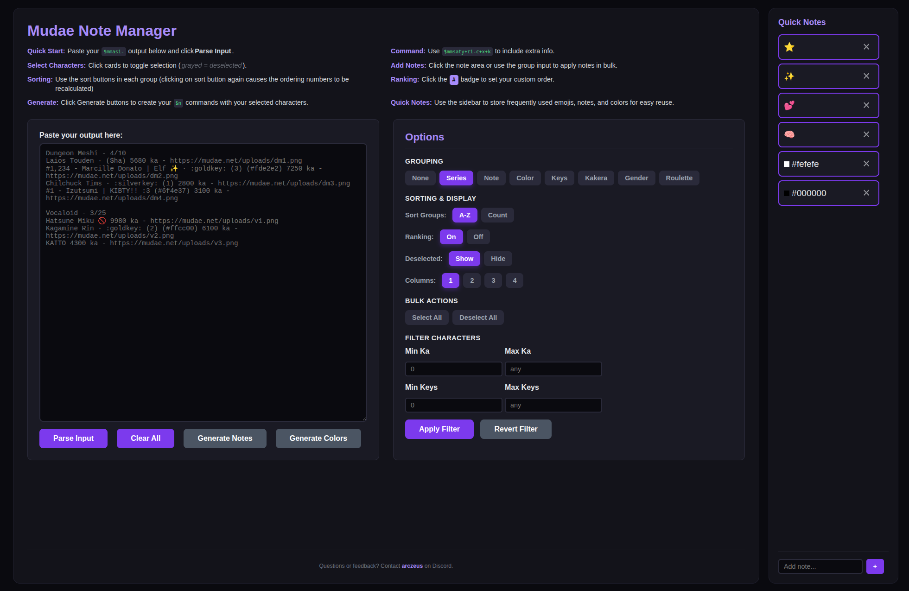

# Mudae Noter

A simple web-based tool to view and note your Mudae collection.  
Designed for use with the [Mudae bot](https://top.gg/bot/432610292342587392) on Discord.

## Features

-   Import your collection from the `$mmsaty+ri-c+x+ko` command and show characters with their images, series, kakera, and key values.
-   Group characters by **Series**, **Note**, or **Keys**. Sort them by **name**, **kakera** or **keys**.
-   A ranking system to number characters. 
-   Add notes individually or to entire groups at once.
-   Automatically create note commands for your selected characters.

## How to Open

Download **[mudae-note-manager.html](mudae-note-manager.html)** and open it in any browser.

## How to Use

1. Run `$mmsaty+ri-c+x+ko` or `$mmasi-` in Discord.
2. Copy the character list.  
3. Paste it in the page and click **Parse Input**.  
4. Add notes as needed.

## Notes

- Large collections may take some time to load.
- This website doesn't and won't work on phones.
- It also may break unexpectedly.
- Please report any bugs.

## To-Do

- ~~Add local storage~~
- ~~Sorting~~
- ~~Add note to a specific character~~
- ~~Add [c+] option~~
- ~~Parse kakera values~~
- ~~Fix characters not getting disabled~~
- ~~Delete any ($togglewestern) or other things that can appear~~
- ~~Cut the name short if it's too long~~
- ~~Go to generated commands button :)~~

Top priority:
- ~~Make groupings work~~
- ~~Deselect by some filter~~
- ~~Sort functionality (in groupings)~~
- ~~Index characters~~ and let the user reorder them by dragging (it's too laggy :c)
- ~~Hide deselected characters~~
- ~~Add ranks~~
- ~~Add gender~~
- ~~Add apply to colors~~

The less important:
- ~~change sort group parse buttons/select buttons ui~~
- ~~Search characters~~ (redundant)
- ~~Add generate $ec command~~
- ~~Add generate $sm command~~ (redundant)
- ~~Add button to apply to selected characters only~~
- ~~Make quick notes draggable (maybe seperate them into colors and notes)~~ (not doing that)

## Bugs

- ~~Apply button changes the selected characters~~
- ~~Sorting changes the selected characters~~
- ~~Some characters can have (2434) in their name and parser gets confused~~
- ~~When clicking a character and deselected is set to hide characters should hide~~
- ~~Website lags when parsing and refreshing~~
- Apply to selected button resets the order

## Images

